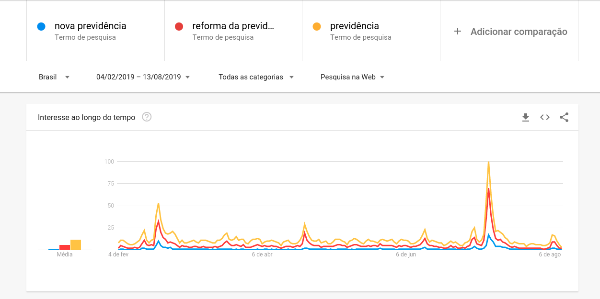

```{r knitr_init, echo=FALSE, message=FALSE, warning=FALSE, cache=FALSE, paged.print=FALSE, results="asis"}
library(magrittr)
library(tidyverse)
library(readr)
library(plotly)
library(lubridate)
library(ggplot2)

knitr::opts_chunk$set(echo = FALSE,
	             cache = FALSE,
               prompt = FALSE,
               tidy = FALSE,
               comment = NA,
               message = FALSE,
               warning = FALSE,
	             fig.width=12,
	             fig.align='center')
```

```{r, message=FALSE}
previdencia_nome_formal <- read_csv("../data/nova_previdencia.csv") %>% 
  mutate(nome_formal = "pec 06/2019")

liberdade_economica_nome_formal <- read_csv("../data/liberdade_economica.csv") %>% 
  mutate(nome_formal = "mpv 881/2019 ")

mercado_agua_nome_formal <- read_csv("../data/mercado_da_agua.csv") %>% 
  mutate(nome_formal = "pls 495/2017")

props_nome_formal <- bind_rows(previdencia_nome_formal, 
                               liberdade_economica_nome_formal,
                               mercado_agua_nome_formal)
```


```{r, message=FALSE}
previdencia_apelido <- read_csv("../data/nova_previdencia_apelido.csv") %>% 
  mutate(apelido = "nova previdência")
liberdade_economica_apelido <- read_csv("../data/liberdade_economica_apelido.csv")%>% 
  mutate(apelido = "liberdade econômica")

props_apelido <- bind_rows(previdencia_apelido,
                           liberdade_economica_apelido)

```

```{r, message=FALSE}
previdencia_comparacao <- read_csv("../data/comparacao_previdencia.csv")
liberdade_economica_comparacao <- read_csv("../data/comparacao_liberdade_economica.csv")
```

```{r, message=FALSE}
meio_ambiente_nome_formal <- read_csv("../data/temas/meio_ambiente/pl_do_veneno.csv") %>% 
  mutate(tema = "Meio ambiente")

agenda_nacional_nome_formal <- read_csv("../data/temas/agenda_nacional/reforma_tributaria.csv") %>% 
  mutate(tema = "Ag. nacional")

int_transp_nome_formal <- read_csv("../data/temas/integridade_transp/pac_moro_anticorrupcao.csv") %>% 
  mutate(tema = "Int. e transparência")

direitos_humanos_nome_formal <- read_csv("../data/temas/direitos_humanos/pec_antiaborto.csv") %>% 
  mutate(tema = "Dir. humanos")

temas_prop_nome_formal <- bind_rows(meio_ambiente_nome_formal,
                                    agenda_nacional_nome_formal,
                                    int_transp_nome_formal,
                                    direitos_humanos_nome_formal)

```


```{r, message=FALSE}
meio_ambiente_apelido <- read_csv("../data/temas/meio_ambiente/pl_do_veneno_apelido.csv") %>% 
  mutate(tema = "Meio ambiente")

agenda_nacional_apelido <- read_csv("../data/temas/agenda_nacional/reforma_tributaria_apelido.csv") %>% 
  mutate(tema = "Agenda nacional")

```

```{r, message=FALSE}
comparacao_meio_ambiente <- read_csv("../data/temas/meio_ambiente/comparacao_pl_do_veneno.csv")
comparacao_agenda_nacional <- read_csv("../data/temas/agenda_nacional/comparacao_reforma_tributaria.csv")

```


##Pressão Recente

Abaixo podemos visualizar a pressão atual e da semana anterior para duas proposições:

###PEC 06/2019 - Nova Previdência

```{r fig.align='center'}

semana_apelido_previdencia <- previdencia_apelido %>% 
  mutate(semana = epiweek(date)) %>% 
  group_by(apelido, semana) %>% 
  summarise(pop_semana = max(pop))

atual_popularidade_previdencia <- semana_apelido_previdencia %>% 
  arrange(desc(semana)) %>% 
  head(2) %>% 
  arrange(apelido, semana) %>% 
  mutate(pop_ant = lag(pop_semana)) %>% 
  arrange(desc(semana))

p <- ggplot(data=atual_popularidade_previdencia,aes(x=apelido, y=pop_semana))+
  geom_bar(aes(y=100),stat="identity",position ="identity",alpha=0.4,fill='grey', width = 0.4) +
  geom_bar(aes(y=pop_ant), stat="identity", position ="identity", alpha=1, fill='pink', width = 0.3) +
  geom_bar(aes(y=pop_semana), stat="identity", position ="identity", alpha=.5, fill='red', width = 0.2) +
  coord_cartesian(ylim = c(0, 100)) +
  xlab("Apelido") + 
  ylab("Pressão") +
  ggplot2::ggtitle("Pressão Recente") +
  scale_y_continuous(labels = function(x) paste0(x, "%"))+
  theme_minimal()

ggplotly(p)
```

Como podemos perceber, a pressão externa da Reforma da Previdência caiu na última semana.

###MPV 881/2019 - Liberdade Econômica

```{r fig.align='center'}

semana_apelido_lib_economica <- liberdade_economica_apelido %>% 
  mutate(semana = epiweek(date)) %>% 
  group_by(apelido, semana) %>% 
  summarise(pop_semana = max(pop))

atual_popularidade_lib_economica <- semana_apelido_lib_economica %>% 
  arrange(desc(semana)) %>% 
  head(2) %>% 
  arrange(apelido, semana) %>% 
  mutate(pop_ant = lag(pop_semana)) %>% 
  arrange(desc(semana))

# p <- atual_popularidade %>%
#   ggplot() +
#   geom_histogram(aes(x=apelido, y=value), stat = "identity", fill = "red", width = 0.6) +
#   geom_histogram(aes(x=apelido, y=value), stat = "identity", fill = "blue", width = 0.2, position = "dodge")

p <- ggplot(data=atual_popularidade_lib_economica,aes(x=apelido, y=pop_semana))+
  geom_bar(aes(y=100),stat="identity",position ="identity",alpha=0.4,fill='grey', width = 0.4) +
  geom_bar(aes(y=pop_ant), stat="identity", position ="identity", alpha=1, fill='pink', width = 0.3) +
  geom_bar(aes(y=pop_semana), stat="identity", position ="identity", alpha=.5, fill='red', width = 0.2) +
  coord_cartesian(ylim = c(0, 100)) +
  xlab("Apelido") + 
  ylab("Pressão") +
  ggplot2::ggtitle("Pressão Recente") +
  scale_y_continuous(labels = function(x) paste0(x, "%"))+
  theme_minimal()

ggplotly(p)
```

Como podemos perceber, a pressão externa da MPV da Liberdade Econômica também caiu na última semana.

##Evolução da Pressão


###PEC 06/2019 - Nova previdência

```{r}
semana <- previdencia_nome_formal %>% 
  mutate(semana = epiweek(date)) %>% 
  group_by(nome_formal, semana) %>% 
  summarise(pop_semana = max(pop)) %>% 
  mutate(segunda = as.Date(paste0('2019', sprintf("%02d", semana - 1), '1'), '%Y%W%u'))
  
p <- semana %>%  ggplot() + 
  geom_area(aes(x=segunda, y = pop_semana), fill = "#FF7700") +
  xlab("Semana") + 
  ylab("Pressão") +
  ggtitle("Evolução da pressão da PEC 06/2019 - Nova previdência") +
  scale_x_date(date_labels = "%d-%m-%Y") +
  scale_y_continuous(labels = function(x) paste0(x, "%"))+
  theme_minimal()
ggplotly(p)
```

**Pico semana 18/02:** Apresentação da Proposta de Emenda à Constituição n. 6/2019, pelo Poder Executivo.

**Pico semana 18/03:** Apresentado vários requerimos de realização de Audiência Pública.

**Pico semana 18/05:** Aprovado requerimento do Sr. Paulo Pereira da Silva que requer a realização de Audiência Pública para debater os itens da Proposta de Emenda à Constituição nº 6, de 2019, a Reforma da Previdência, do Poder Executivo (Comissão Especial).

**Pico semana 08/07:** Votação em primeiro turno no plenário da câmara.

**Queda acentuada semana 15/07:** Recesso parlamentar

###MPV 881/2019 - Liberdade Econômica

```{r}

semana <- liberdade_economica_nome_formal %>% 
  mutate(semana = epiweek(date)) %>% 
  group_by(nome_formal, semana) %>% 
  summarise(pop_semana = max(pop)) %>% 
  mutate(segunda = as.Date(paste0('2019', sprintf("%02d", semana - 1), '1'), '%Y%W%u'))
  
p <- semana %>%  ggplot() + 
  geom_area(aes(x=segunda, y = pop_semana), fill = "#7678ED") +
  xlab("Semana") + 
  ylab("Pressão") +
  ggtitle("Evolução da pressão da MPV 881/2019") +
  scale_x_date(date_labels = "%d-%m-%Y") +
  scale_y_continuous(labels = function(x) paste0(x, "%"))+
  theme_minimal()

ggplotly(p)

```

**Pico semana 17/06:** Materia foi recebida pelo relator (CMMPV). Apresentação de 2 requerimentos de audiência pública.

**Pico semana 08/07:** Aprovado parecer na comissão (CMMPV)

**Semana 15/07:** Medida Provisória enviada à Câmara dos Deputados

###PLS 495/2017 - Mercado da Água

```{r}

semana <- mercado_agua_nome_formal %>% 
  mutate(semana = epiweek(date)) %>% 
  group_by(nome_formal, semana) %>% 
  summarise(pop_semana = max(pop)) %>% 
  mutate(segunda = as.Date(paste0('2019', sprintf("%02d", semana - 1), '1'), '%Y%W%u'))

p <- semana %>%  ggplot() + 
  geom_area(aes(x=segunda, y = pop_semana), fill = "#BFACAA") +
  xlab("Semana") + 
  ylab("Pressão") +
  ggtitle("Evolução da pressão da PLS 495/2017") +
  scale_x_date(date_labels = "%d-%m-%Y") +
  scale_y_continuous(labels = function(x) paste0(x, "%"))+
  theme_minimal()

ggplotly(p)

```

**Pico semana 20/05:** Não conseguimos explicar

**Pico semana 15/07:** ["Consulta pública sobre venda do aquífero Guarani"](https://www1.folha.uol.com.br/poder/2019/07/nao-existe-consulta-publica-sobre-venda-do-aquifero-guarani-nem-bolsonaro-e-guedes-estao-envolvidos.shtml)

Postagem falsa liga governo a PL de 2017 e que não se refere à venda do aquífero Guarani


##Fonte da Pressão: Nome Formal vs. Apelido

```{r}
# Comparação entre nome formal e apelido
semana_comp <- previdencia_comparacao %>% 
  mutate(semana = epiweek(date)) %>% 
  group_by(semana) %>% 
  summarise(pop_semana_nf = max(pop_nome_formal),
            pop_semana_ap = max(pop_apelido))

semana_comp_ap <- semana_comp %>% 
  select(pop = pop_semana_ap, semana) %>% 
  mutate(nome_prop = "nova previdência") %>% 
  mutate(segunda = as.Date(paste0('2019', sprintf("%02d", semana - 1), '1'), '%Y%W%u'))


semana_comp_nf <- semana_comp %>% 
  select(pop = pop_semana_nf, semana) %>% 
  mutate(nome_prop = "pec 06/2019") %>% 
  mutate(segunda = as.Date(paste0('2019', sprintf("%02d", semana - 1), '1'), '%Y%W%u'))

semana_comp <- bind_rows(semana_comp_ap, semana_comp_nf)

p <- semana_comp %>% group_by(semana, nome_prop) %>%  ggplot() + 
  geom_area(aes(x=segunda, y = pop, fill = nome_prop)) +
  xlab("Semana") + 
  ylab("Pressão") +
  ggtitle("Comparação da evolução da pressão - PEC: Apelido vs Nome formal") +
  scale_x_date(date_labels = "%d-%m-%Y") +
  scale_y_continuous(labels = function(x) paste0(x, "%"))+
  theme_minimal() +
  facet_grid(rows = vars(nome_prop)) 
  

ggplotly(hide_legend(p))

```

###Comparação entre termos comuns para PEC 06/2019

<div style="width:1000px">

</div>

Como podemos perceber, existem apelidos mais populares (maior pressão) para a Reforma da Previdência, mas cujo comportamento da curva é o mesmo.


```{r}
# Comparação entre nome formal e apelido
semana_comp <- liberdade_economica_comparacao %>% 
  mutate(semana = epiweek(date)) %>% 
  group_by(semana) %>% 
  summarise(pop_semana_nf = max(pop_nome_formal),
            pop_semana_ap = max(pop_apelido))

semana_comp_ap <- semana_comp %>% 
  select(pop = pop_semana_ap, semana) %>% 
  mutate(nome_prop = "liberdade econômica")  %>% 
  mutate(segunda = as.Date(paste0('2019', sprintf("%02d", semana - 1), '1'), '%Y%W%u'))

semana_comp_nf <- semana_comp %>% 
  select(pop = pop_semana_nf, semana) %>% 
  mutate(nome_prop = "mpv 881/2019") %>% 
  mutate(segunda = as.Date(paste0('2019', sprintf("%02d", semana - 1), '1'), '%Y%W%u'))

semana_comp <- bind_rows(semana_comp_ap, semana_comp_nf)

p <- semana_comp %>% group_by(semana, nome_prop) %>%  ggplot() + 
  geom_area(aes(x=segunda, y = pop, fill = nome_prop), show.legend = FALSE) +
  xlab("Semana") + 
  ylab("Pressão") +
  ggtitle("Comparação da evolução da pressão - MPV: Apelido vs Nome formal") +
  scale_x_date(date_labels = "%d-%m-%Y") +
  scale_y_continuous(labels = function(x) paste0(x, "%")) +
  theme_minimal() +
  facet_grid(rows = vars(nome_prop)) 
  
ggplotly(hide_legend(p))
```
**Pico semana 29/04:** Publicada no DOU de 30/04/2019, Edição Extra B, na página 1, a Medida Provisória 881/2019.

